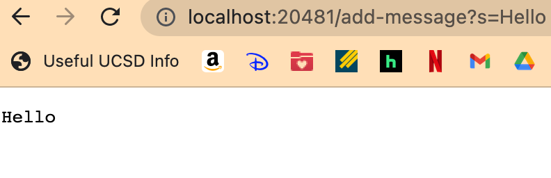
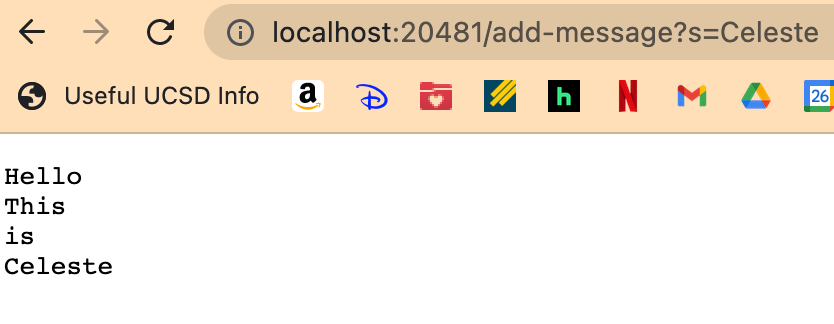
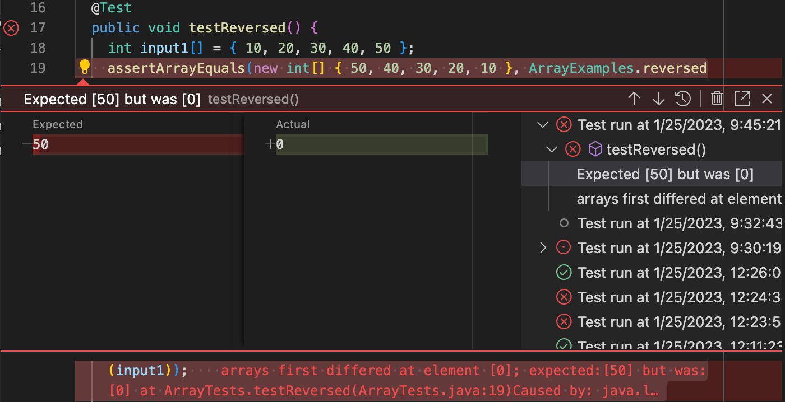
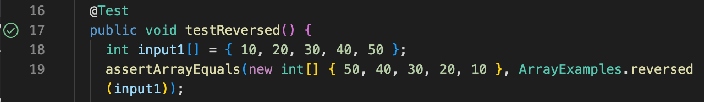

Link to my [website](https://celestewv.github.io/cse15l-lab-reports)


*Author:* Celeste Walstrom-Vangor 
<br> *Data Created:* 01/11/23 
<br> *Class:* CSE 15L 


# Blog Post 2:

## Part 1
### Creating a Web Server called ```StringServer```
The goal was to create a code which took in the command at the back of local or global host url:
```/add-message?s=<string>```
and then made the string appear on the screen. It should be permanent, and continue adding words on the next line.
Here is the code I used to make this happen:
```
import java.io.IOException;
import java.net.URI;
import java.util.ArrayList;

class Handler implements URLHandler {
    // The one bit of state on the server: a number that will be manipulated by
    // various requests.
    int num = 0;
    ArrayList<String> strList = new ArrayList<>();

    public String handleRequest(URI url) {
        if (url.getPath().equals("/")) {
            return String.format("List of Strings:" + strList);
        } else {
            System.out.println("Path: " + url.getPath());
            if (url.getPath().contains("/add-message")) {
                String[] parameters = url.getQuery().split("=");
                if (parameters[0].equals("s")) {
                    strList.add(parameters[1] + "\n");
                    String toReturn = "";
                    for (int i = 0; i < strList.size(); i++) {
                        toReturn += strList.get(i);
                    }
                    return toReturn;
                }
            }
            return "404 Not Found!";
        }
    }
}

class SearchEngine {
    public static void main(String[] args) throws IOException {
        if (args.length == 0) {
            System.out.println("Missing port number! Try any number between 1024 to 49151");
            return;
        }

        int port = Integer.parseInt(args[0]);

        Server.start(port, new Handler());
    }
}

```
This paired with ```Server.java``` file that was provided in class made this code execute as I expected. I wanted to make sure it worked with multiple tries/strings. I started with 'Hello'


Then I add 'this', 'is' and 'Celeste' on three seperate tries and it add them each to a seperate line as I had hoped.

***

## Part 2
### Chosen Code from Lab 3 = Original Code from the ``` reversed(int[] arr) ``` method in ```ArrayExamples```

#### The Chosen Buggy Program Input/Test:
Orinal & Buggy Code:
```
static int[] reversed(int[] arr) {
    int[] newArray = new int[arr.length];
    for(int i = 0; i < arr.length; i += 1) {
      arr[i] = newArray[arr.length - i - 1];
    }
    return arr;
  }
  
```
JUnit test:
```
@Test
  public void testReversed() {
    int[] input1 = { 1, 2, 3 };
    assertArrayEquals(new int[]{ 3, 2, 1 }, ArrayExamples.reversed(input1));
  }
```
Without debugging this code, this code did not produce the expected result. 
We expected the code to run on the inputed { 1, 2, 3 } and return { 3, 2, 1 }. 
However, with the bugs, the code returned the original inpu: { 1, 2, 3 }.

#### The Debugged Code:
```
static int[] reversed(int[] arr) {
    int[] newArray = new int[arr.length];
    for (int i = 0; i < arr.length; i++) {
      newArray[i] = arr[arr.length - i - 1];

    }
    return newArray;
  }

```
The Test that Does not Induce Failure:
```
public void testReversed() {
    int input1[] = { 10, 20, 30, 40, 50 };
    assertArrayEquals(new int[] { 50, 40, 30, 20, 10 }, ArrayExamples.reversed(input1));
}
```
After fixing the bugs in the code, the previous test passed. We expected the input { 10, 20, 30, 40, 50 }
to produce the output { 50, 40, 30, 20, 10 }. We knew the basic code was debugged after receiving the correct
output.

#### Symptom
The symptom we can observe from the faulty code is that the code is not reversing the elements as we had expected
it to. Once we debug the code, the symptom is no longer present in most regular inputs.
Here is the JUnit Test failing with the input { 10, 20, 30, 40, 50, 60 } before the code is debugged.


Here is the JUnit Test passing with the same input as above now that code has been fixed.


#### Bug 
There were a couple of fixes that needed to be made in this code. The first one was that we were setting the original array ``` arr ``` equal to the ```newArray[arr.length - i - 1]```. Since the new array had nothing added to it, we were simply changing the orginal array's elements to 0. By reversing the ```arr``` with the ```newArray``` and returning the ```newArray``` we were able to debug the code. I would aldo recommend adding some error catching by adding if statments, but other than that, the code runs as expected.

Buggy Code:
```
static int[] reversed(int[] arr) {
    int[] newArray = new int[arr.length];
    for(int i = 0; i < arr.length; i += 1) {
      arr[i] = newArray[arr.length - i - 1];
    }
    return arr;
  }
```
Debugged Code:
```
static int[] reversed(int[] arr) {
    int[] newArray = new int[arr.length];
    for (int i = 0; i < arr.length; i++) {
      newArray[i] = arr[arr.length - i - 1];

    }
    return newArray;
  }
```
***

## Part 3
### Something I learned in Lab week 2 or 3:
I learned the brim of complexity of the coding behind URLs. I had never put any thought into what goes on behind the scenes in searching or changing from one page to another. But I am beginning to understand the coding that is behind changing the webpage based on the inputed URLs.
