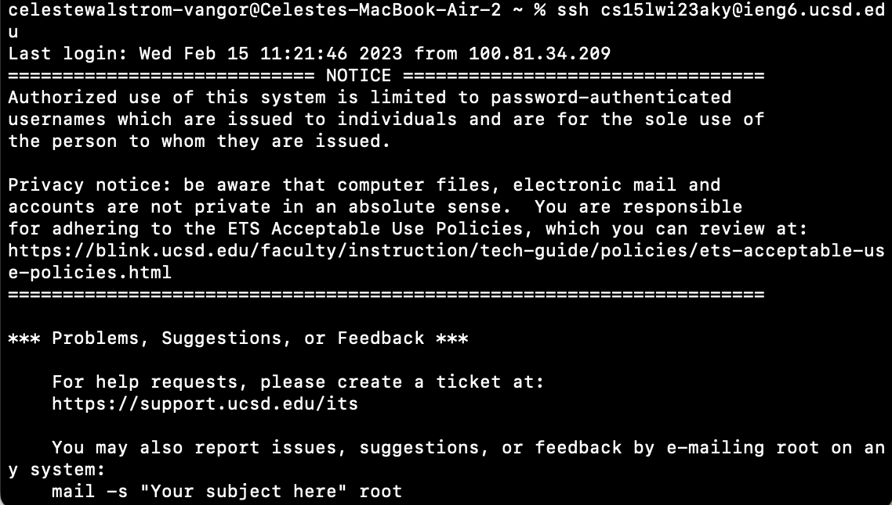

Link to my [website](https://github.com/celestewv)

Link to this [page](https://celestewv.github.io/cse15l-lab-reports/LabReport3.html)


*Author:* Celeste Walstrom-Vangor 
<br> *Data Created:* 02/26/23 
<br> *Class:* CSE 15L 


# Blog Post 4:

## “Done Quick”

This Lab included 9 steps and times students to figure out the most efficient ways of producing results in the terminal.
The first 3 steps were untimed but important for the context of the entire lab. Step one was: Delete any existing
forks of the repository you have on your account. So forking the repository so that each student does not have duplicates.
Next, we had to Fork the repository, so we each had out own copy. Lastly, Start the timer!


### Step 4: Log into ieng6



```diff +
> *Keys to Press:* I first typed: ssh cs15lwi21aky@ieng6.ucsd.edu and then pressed 

```
### Step 4: Log into ieng6


 


