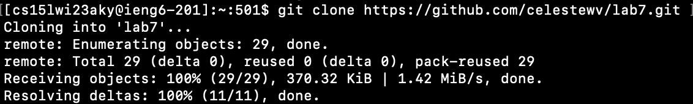
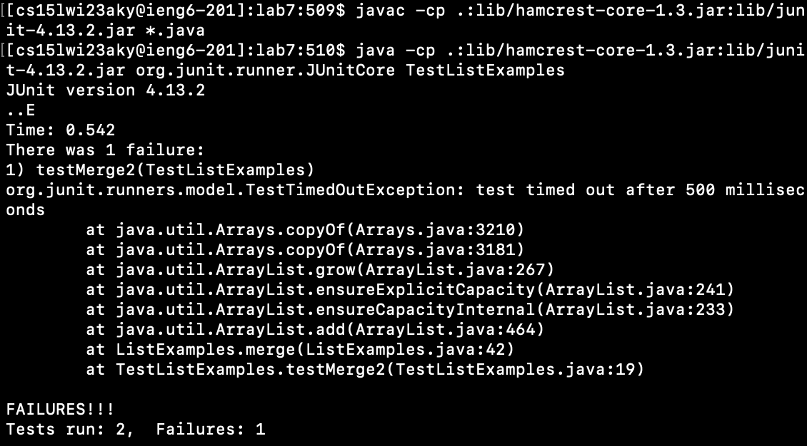
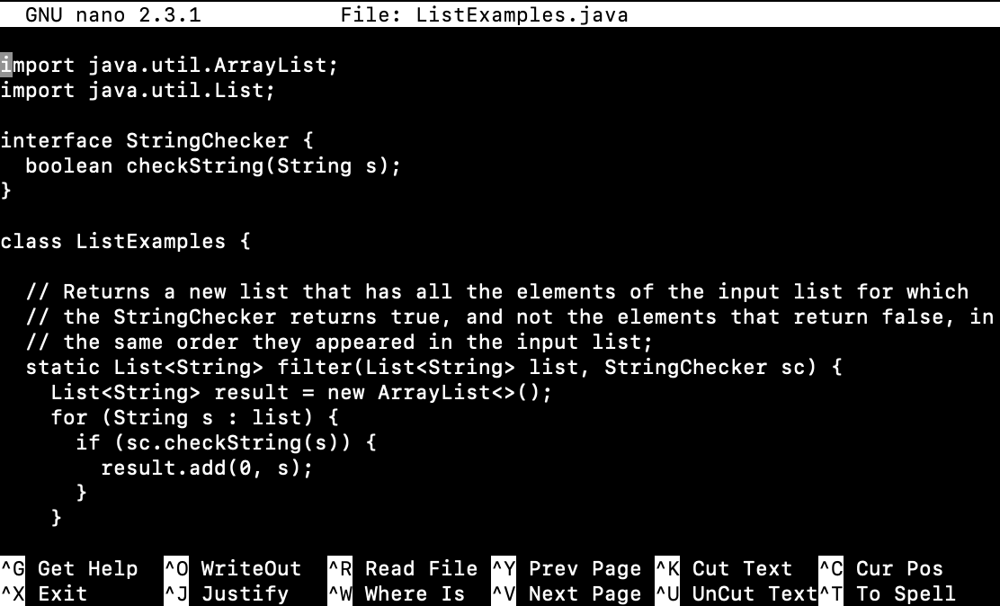

Link to my [website](https://github.com/celestewv)

Link to this [page](https://celestewv.github.io/cse15l-lab-reports/LabReport3.html)


*Author:* Celeste Walstrom-Vangor 
<br> *Data Created:* 02/26/23 
<br> *Class:* CSE 15L 


# Blog Post 4:

## “Done Quick”

This Lab included 9 steps and times students to figure out the most efficient ways of producing results in the terminal.
The first 3 steps were untimed but important for the context of the entire lab. Step one was: Delete any existing
forks of the repository you have on your account. So forking the repository so that each student does not have duplicates.
Next, we had to Fork the repository, so we each had out own copy. Lastly, Start the timer!


### Step 4: Log into ieng6


> *Keys to Press: I first typed: ssh cs15lwi21aky@ieng6.ucsd.edu and then pressed* ```<enter>```


### Step 5: Clone the fork of the repository from your Github account




> *Keys to Press:*
> *I first typed: git clone and then pressed ^C to copy the link* *https://github.com/celestewv/lab7 and added '.git' to the end. Then I pressed* ```<enter>```
 
 
### Step 6: Run the tests, demonstrating that they fail
 
 
 
 
> *Keys to Press: First I ran ```cd lab7``` to run the tests. Then I ^C from the lab directions and ^V into the terminal javac -cp .:lib/hamcrest-core-1.3.jar:lib/junit-4.13.2.jar *.java and pressed ```<enter>``` then I did the same with java -cp .:lib/hamcrest-core-1.3.jar:lib/junit-4.13.2.jar org.junit.runner.JUnitCore but typed T and pressed ``<tab> to fill in TestListExamples and then pressed* ```<enter>```
 
 
### Step 7: Edit the code file to fix the failing test

> *Keys to Press: First I ran ```nano ListExamples.java``` which brought me to the screen shown below. Then I presssed the ```<down>``` arrow until I got to the second method and changed the second ```index1``` to an ```index2``` to debug. Then I pressed ^O to read the file and ^X to exit.*


 
 
 ### Step 8: Run the tests, demonstrating that they now succeed

> *Keys to Press: First I pressed* <up><up><up><up><up><enter>, <up><up><up><up><up><enter> *because I had already typed the junit commands to run the tests earlier.*


 


