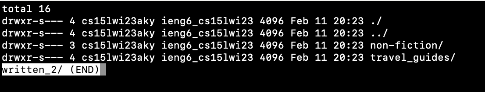

Link to my [website](https://github.com/celestewv)

Link to this [page](https://celestewv.github.io/cse15l-lab-reports/LabReport3.html)


*Author:* Celeste Walstrom-Vangor 
<br> *Data Created:* 03/12/23 
<br> *Class:* CSE 15L 


# Blog Post 5:

## “Favorite Lab”

In this lab report, I will be re-exploring my favorite Lab, Lab 3. In that lab report, I found alternate ways to use the command ```find```. 
In this lab report, I am going to explore the ```less``` command.

### Chosen Command: ```less```

### Background Information on the ```less``` Command:

According to the Linux manual page the ```less``` command:
       "Less is a program similar to more(1), but which allows backward
       movement in the file as well as forward movement.  Also, less
       does not have to read the entire input file before starting, so
       with large input files it starts up faster than text editors like
       vi(1).”

*Source: [https://man7.org/linux/man-pages/man1/find.1.html](https://man7.org/linux/man-pages/man1/less.1.html)) found through searching 'find command-line options'*

Regular Use of the ```less``` command:

What I typed: ```less written_1/```

What was produced:



### Here Are a Couple Interesting Command-Line Options

Option 1)
```less -F <filename>```

Explanation: This command is used to view the contents of a file in the terminal using the "less" command. 

Example 1) ```less -F written_2/```


Example 2) ```less -F written_2/non-fiction/OUP/Berk/```


Option 2)
```less -N <filename>```

Explanation: This command is used when wanting to see the specified text file with line numbers included. I comes in handy when reviewing long code

Example 1) ```less -N written_2/non-fiction/OUP/Berk/ch2.txt```


*There were more lines of code that could not fit into the screen*

Example 2) ```less -N written_2/non-fiction/OUP/Berk/```


Option 3)
```less <filename> <filename>```

Explanation: This command allows you to view and open more than one file at a time and keep track of which file you are in. Can be useful for editting multiple files or reading more than one file with one command.

Example 1) ```less ch2.txt ch1.txt```


Example 2) ```less written_2/non-fiction/OUP/Berk written_2/non-fiction/OUP/Fletcher```


Source for all of these options: [Works Cited](https://phoenixnap.com/kb/less-command-in-linux)

